## Introduction

I've spent the past 300days (actually 296) recording my daily stats on Apex to see if I could find any trends hoping to understand more about their skill based match making (SBMM). I was inspired by [istiri7's](https://www.reddit.com/user/istiri7) post about recording [500 games of solo'q to learn more about SBMM](https://www.reddit.com/r/apexlegends/comments/tw9bmh/i_solo_qd_500_trios_to_learn_more_about_apex_sbmm/), and wondered if there are any trends you could see over the seasons, rather than at the macro level of 500 individual games.

In this article I'm going to go in-depth over what I've found so far; the reason I'm posting this before I reach 300, or even before I reach my original goal of a year - is because there is a lot of talk about SBMM at the moment not only about Apex, but other games such as Overwatch and Modern Warfare as well. And I wanted to share what I had found so far, before I miss my chance to be part of this discussion.

## Data Collection

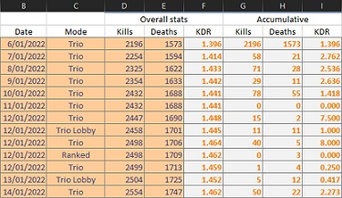{ align=right }

All of the input data is simply collected in a single Excel sheet. This includes the date, mode, total kills, and total deaths for that season so far. Every time I switch mode, I log this data (i.e. if I go from play trios to ranked) - and at the end of each day I log the data. This allows me to derive the number of kills and deaths per mode per day. Which is seen on the right hand side. This information can then be used to find the lifetime data per mode as well as other information discussed in this article.

## Lifetime Statistics

---

!!! info ""
	All statistics from this section on are only from solo-q trio games, the kills and deaths from other modes such as ranked, duos, and times I played with friends have been omitted from these results.

### Lifetime KDR
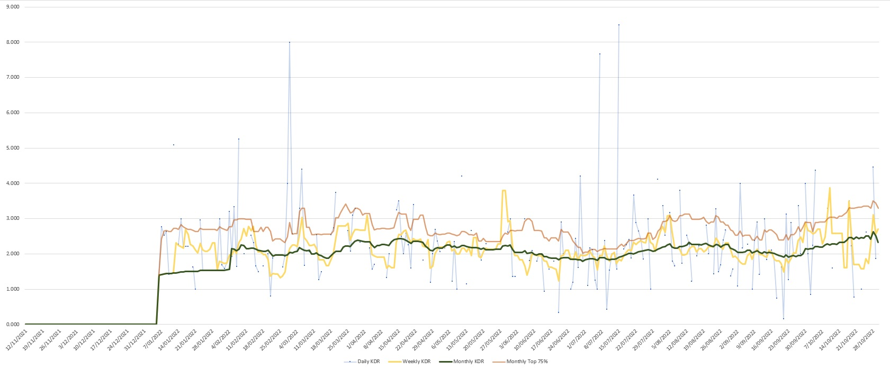

The light blue dots represent a single day, with the blue like connecting them showing consecutive days of play. The yellow line is the KDR based on the sum of kills and deaths from the last 7 days (rather than an average of the daily KDR of the last 7 days). Similarly the green line shows the total KDR of the past 30days. The salmon line shows the top 25th percentile daily KDR from the past 30 days (explained more in the next section).

There aren't any inherently obvious trends visible from this chart, other than there appears to be a sine-wave like trend occurring, so there likely is a seasonality measurement for this data.

### KDR Percentiles

=== "Per-Season Daily KDR"
	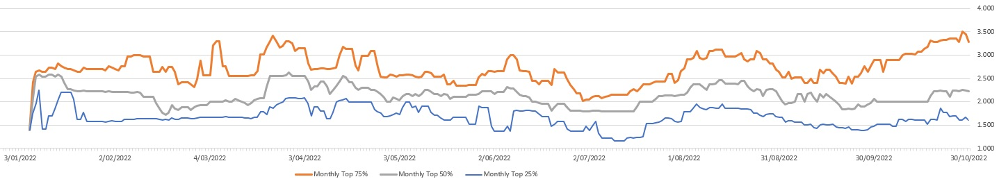
=== "Normalised"
	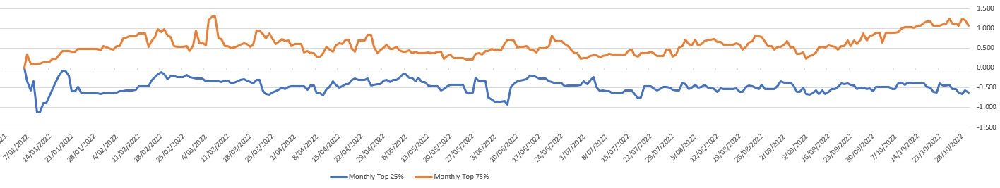

These graphs use a sliding window of the past 30days of KDR values. Based on these samples it takes the value at a certain percentile for each window. So the 75% line is the KDR value marking the top 25% of your KDRs over the last 30 days.

The normalised view makes the 25% and 75% values relative to the median (50%) KDR.

There is not much information that can be derived from this, other that something appears to have changed on the 9th of September in relation to the match making. Nothing in my daily life would give reason to a sudden gradual growth in my skill.

### Seasonality

| Factor | Seasonality (days) |
|:-|:-|
| Daily KDR | 71 |
| Weekly KDR | 21 |
| 30 Day Median KDR | 74 |
| 30 Day Top 25% KDR | 60 |

When using the `Daily KDR`, `30 Day Median KDR`, `30 Day Top 25% KDR` to estimate the seasonality of the data[^1] - they all agree on a $\approx 73 \text{ day}$ interval between seasons. This means your peak performance in terms of KDR will occur about every $73\text{ days}$. This is very interesting as the average Apex season is about $90\text{ days}$. However my university semesters are 11-12 weeks each, if we say I'm only in uni for 11 weeks because I don't focus during O-week, then we get $11 \times 7 = 77\text{ days}$ which is almost our $73\text{ days}$ we are looking for. However my semesters are not evenly spaces apart, so if my university semesters were the cause of the seasonality that could interfere with the estimate calculated.

[^1]: The seasonality is calculated using [Excel's build-in functions](https://support.microsoft.com/en-us/office/forecast-ets-seasonality-function-32a27a3b-d22f-42ce-8c5d-ef3649269f3c).

## Individual Season Statistics

---

### Statistics per Mode

!!! info ""
	The below statistics are pull straight from the Apex menu's for statistics per season. `All Modes` is your overall stats for the season, `Ranked` is the stats for each ranked season, `Non-Ranked` is calculated based on removing your ranked results from your `All Modes` results. Hence `Non-Ranked` will include `trios`, `duos`, `solo-q`, and partying statistics.

=== "Average Damage"
	All Modes  
	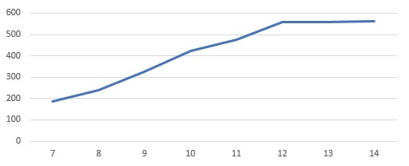  
	Ranked  
	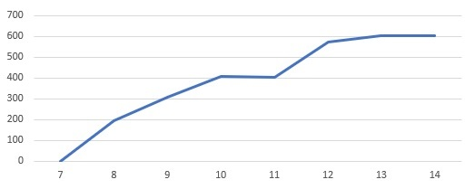  
	Non-Ranked  
	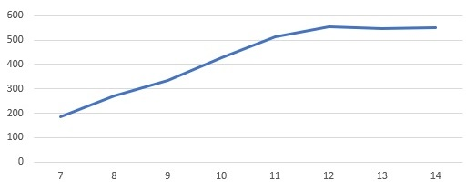  
=== "KDR"
	All Modes  
	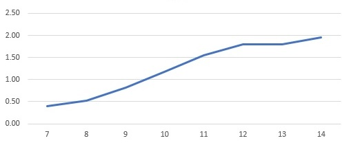  
	Ranked  
	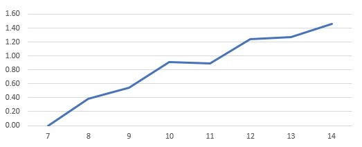  
	Non-Ranked  
	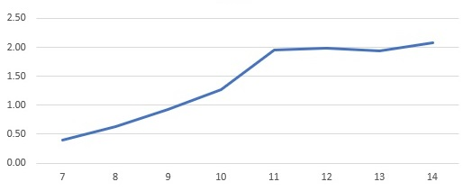  
=== "Win Rate%"
	All Modes  
	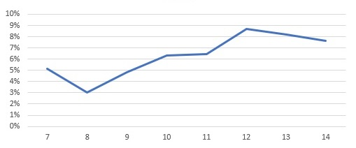  
	Ranked  
	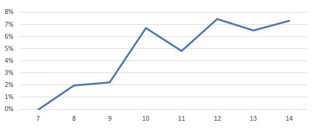  
	Non-Ranked  
	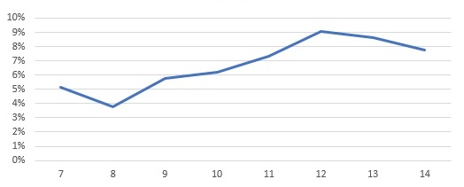  
=== "Top 5 Placements%"
	All Modes  
	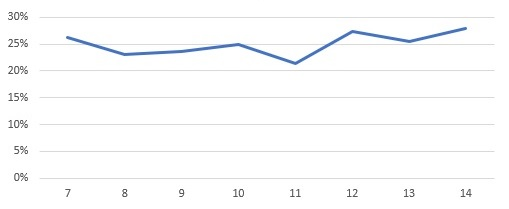  
	Ranked  
	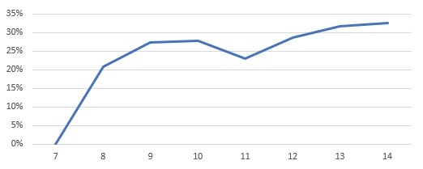  
	Non-Ranked  
	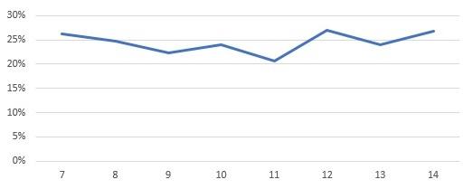  
=== "Games Played"
	All Modes  
	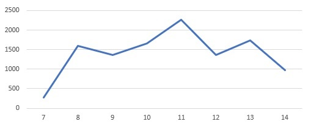  
	Ranked  
	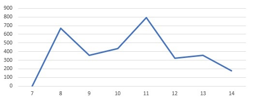  
	Non-Ranked  
	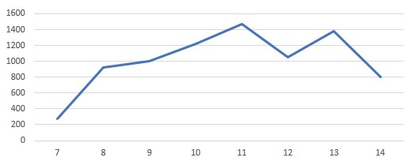  

Looking at the `KDR` and `Average Damage` per season, they both tell a similar story. Around season 11 SBMM kicked into high gear, as soon as my KDR reached 2, clearly the system intentionally started putting me into matches aimed to make the game hard enough for me to bring me down to the level of those around me. You can also compare this to the ranked scores and see that I was still improving, which can also be backed up with my Kovaaks scores at the time as well. Clearly I did not hit my skill ceiling and instead something else is happening. I suspect around the 2KDR mark is when Big-Brother matchmaking[^2] really starts to kick in. Before 2KDR the match maker likely just puts you into lobbies with increasing skill as you progress, but once you've hit the 2KDR point it decides it can no longer find matches for you at the frequency desired, so instead it puts you into a lobby at a lower level than you, but with teammates even lower level that the lobby's in hopes of weighing you down to make your team's level equivalent to the lobby.

[^2]: **Big-Brother Matchmaking** is the term to describe a match making algorithm intentionally pairing a high skill player with lower skill players in an attempt to create a team of equivalent skill of the other(s). This then creates a team dynamic where the higher skill player has to play the role of the ^^big brother^^ in the team.

Interestingly though `win rate` does not appear to be affected to a similar degree to `KDR` and `Average Damage`, instead what is interesting is to look at the percent number of times placed in the top 5. This metric is held incredibly constant, and even more suspicious is that it tends around the 25% mark, which also happens to be the statistical chance of coming 5th out of 20 if all things are equal. This shows that while the Apex SBMM system may not be good at making individual matches balanced, as a whole it appears to be remarkably good if we assume it's goal is to optimise fair top 5 placements.

### Per Season KDR over time

!!! info ""
	All statistics from this section on are only from solo-q trio games, the kills and deaths from other modes such as ranked, duos, and times I played with friends have been ommited from these results.

=== "Per-Season Daily KDR"
	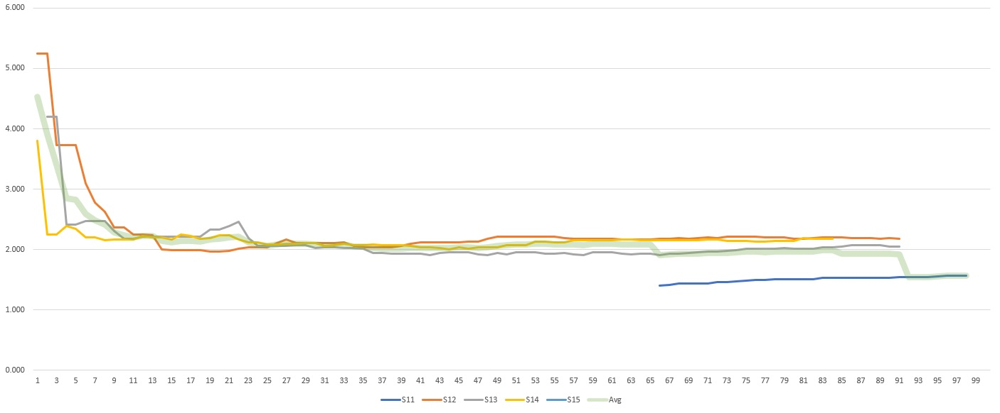
=== "Zoomed"
	> Skips the first 10days

	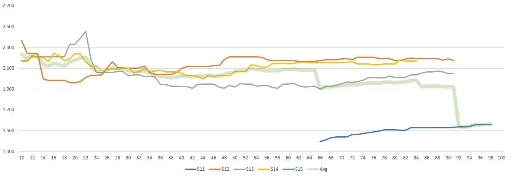

Very peculiarly days 1-10 of each season always have much higher KDR than the rest of the season. If a few, or even the majority (but not all) had a higher KDR you could easily claim it's a few lucky results, as the earlier in the season, the less games have been played, so the higher variability present in results. However the fact all of the seasons start around the 4KDR range, then all follow a similar path back down to normalising to ~2KDR it raises an interesting question.

If you couple these results with the results from the [Statistics per Mode](#statistics-per-mode), and interesting thought comes to mind. The match making clearly attempts to prevent you from going above 2KDR, so why does it always fail to do so in the first week of each season? I believe the answer is what data the match maker is running off. I believe the match maker's internal values reset every season - so the first day of each season you play, you could almost think of like if Apex didn't have match making.

## Week Day Statistics

---

Overall there is around 0.5 KDR difference based on what day of the week you play. It seems tuesday and friday appear to be the best days to play but only by a slim margin. From this it is quite clear, what day of the week you play doesn't appear to impact your match making a significant amount, most likely time of day would have a large impact, however that was not tracked.

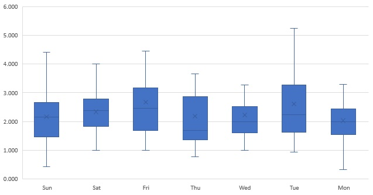

---

## Conclusion

SBMM clearly tries to prevent any players from dominating the lobbies they are in, however the SBMM system appears to create a skill ceiling instead of allowing skill growth to be met with a logarithmic return. This will likely destroy any sense of player skill progression within this this mode, as they are not able to experience any improvements in their performance once they reach a certain point. SBMM has a clear focus on top 5 placements at it's core, with KDR as a secondary core metric, with damage likely not playing a part and instead being a corelation with kills.

There does not appear to be a periodic change in performance over time if we assume my university semesters are the main driving factor. My university has it's semesters largely out of sync with other universities so I doubt other players would experience the same cycle as the majority of the player base isn't going through the same labour cycle. Let alone I doubt the majority of players are uni students anyway.

There have been signs of the developers changing the match making over time (more discussed in [Further More](#further-more)), it is clearly an on going process of refinement, and the developers aren't sitting on their lorals.

## Discussion

Overall I believe SBMM **should** remain a part of Apex, however I do not agree with the current state of SBMM. To explain this let's look at two potential options.

!!! example "A World Without SBMM"
	In this world players would simply sit in one massive queue, as soon as there are 60 people, the first 60 people would get into the same game, and the rest would wait for the next lobby. First in first serve, no skill consideration. This means everyone from a player learning to use a mouse, to iiTzTimmy, to MattyOW would be in the same lobby. I think people under-estimate how unenjoyable this would be after a week. This means you could very likely end up always playing against people who don't even know how to move or shoot - if you have a good grasp on the mechanics of the game you're going to be shooting targets which basically don't fight back all day and it will get very boring.

	If you don't believe me, and you're in the top 10-20% of players, I implore you to boot up a old shooter without SBMM. I recently went back to Xonotic (a quake like shooter), and for the first couple of hours it was fun as heck. Getting 3-10x the score of my opponents every game. But eventually it got kind of boring because I was never really challenged.

	Also for those of you who aren't high skill level, thing about the fact for every 2KDR player, there is either one player with 0.5, or two players with 1KDR. That's just how the maths works out. If 10% of your player base has a 8KDR, the other 90% are forced to play with them an equal about as anyone at any other skill level. That 90%'s average KDR will be 0.2, even if the majority of your player base doesn't care about kills, there are a lot that will leave if that's what playing is like.

	$$
	\begin{align*}
	10\% \times 8\text{ KDR} + 90\% \times x &= 1 && \\
	90\% \times x &= 1 - 10\% \times 8\text{ KDR} && \\
	x &= \frac{1 - 10\% \times 8\text{ KDR}}{90\%} && \\
	x &= 0.\overline{222}\text{ KDR} && \\
	\end{align*}
	$$

!!! example "A World with "Perfect" sbmm"
	In this world every match is perfectly balanced, all teams are perfectly equal, crafted to ensure all teams share the same weaknesses and strengths. In this world you will never feel a sense increase in skill. Ask you get better, you will be match made so that it won't make a difference in the out-come of your games. Because all teams are equal.

	The only sense of progression you'll have is your moment to moment performance, how quickly you beam someone, how accurate are you shots, how sick of a wall bounce into superglide tap strafe. However none of that will actually impact how well your games perform over all, because who ever your versing will be able to counter that because all teams are balanced.

Neither of these worlds results in a long living game. The best option is something inbetween that allows players to have fair games, while still allowing for a sense of progression. That's specifically why earlier I complained about a skill ceiling, and instead requested a logarithmic skill progression. This allows the majority of players to experience a sense of progression, however as you get closer and closer to the higher elo, your sense of progression will slow down. Because without we end up with the 8:0.2 KDR situation.

### Ranked vs SBMM

!!! quote "Technical Director on Apex at Respawn [Samy Duc](https://twitter.com/ricklesauceur/status/1585846276318318592)"
	[.. sbmm] is just matchmaking with skill rating, so by definition just matchmaking [...]

	The progression on top is to give you a sense of achievement nothing more, you are what you are and progressing your actual skill at the game take way longer than the short loop of reward/dopamine you get when finishing a single game.

	To get back at the question, pubs usually does not get a progression system and therefore is less sticky to players compared to ranked. But ranked can be scary, because people care about their progression number so you have to offer a way for people to engage with the game [...]

To avoid the 8:0.2 SBMM problem, we need to include skill ratings to normal match making. But similarly ranked has become more like normal play, because they've made skill based system with an emphasis on fun. So you have a fun based mode with an emphasis on skill, and a skill based mode with an emphasis on fun, so the only difference between ranked and norms is the exact parameters and whether or not the skill rating is shown (i.e. rank). Since seems kind of like a sad rebranding of two things hoping people enjoy both namings.

### Improvements

Personally I think SBMM does need to be in normal game play, but big brother match making should be removed, or heavily nerfed. Yes that will increase the likely hood of the 8:0.2 problem, however we're only increasing it in the top end which creates a interesting side affect.

For those who are in the middle of the pack, who would be versing people who are normally big-brothered into their lobbies. When they verse those players they will perform worse, that will bring down their rating, they will verse the lower players, have some fun easier frags and get their stats up to head butt with the high elo again. The high elo remain able to have a sense of progression, as their KDR can still feasibly go up, and they don't have the sensation of increasing sand bags at their heels pulling down their soul.

I think there is a massive reason why all of the solo-q players play a lot of no-fill, it's because the big brother affect is so bad, they may as well have no one, rather than low elo players to carry.

## Further More

There are a few double peaks present in histogram KDR charts which hints at some interesting findings. First of all, an imperfect match maker, which not all games a balanced, but on average the results balance out - these results will follow a normal curve according to statistics fundamentals. However the below charts have double peaks which can only mean one thing. The system changed / there are multiple statistical systems occurring at once. If the histogram showed a improvement or degradation of skill, the graphs should be skewed, because improvement is a gradual process, not a jump in skill. However a double peak implies drastic changes, like the match maker being tweaked.

However most of these double peaks happen around the season end/start mark, which is when KDRs spike as seen in the [Statistics per Mode](#Statistics per Mode), this means either the match maker hasn't been updated drastically, and instead all changes are fine tuning. Or all major changes only happen on the start of a season. Either than or the match making stats just reset every season and match making hasn't changed since S11 - which I doubt.

=== "May"
	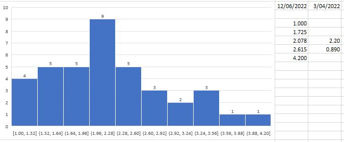
=== "September"
	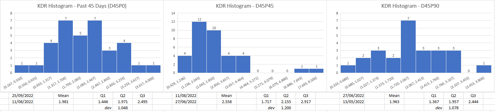