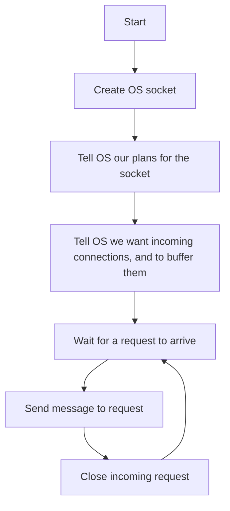
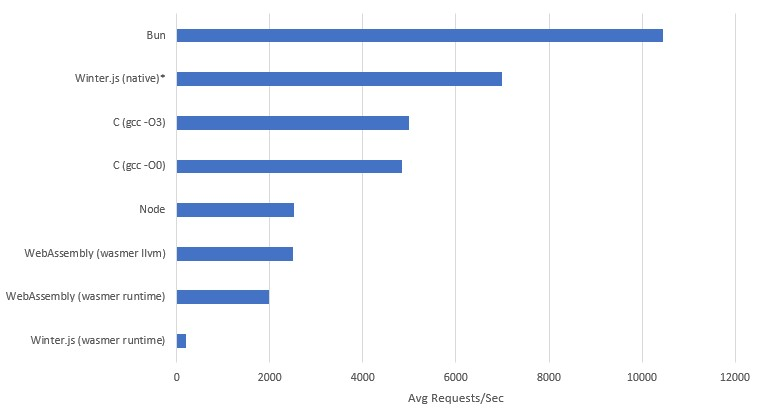

Wasmer.io recently released an article announcing their [Winter.js 1.0](https://wasmer.io/posts/winterjs-v1), however looking at the details of their [benchmarks](https://github.com/wasmerio/winterjs/tree/main/benchmark) it shows that running Winter.js in wasm results in a 12x slow down in performance compared to native.

That large a performance difference just doesn't sit right with me based on my experience with wasm, yes it should be slower, I would believe 4x, but 12x!?!?!? What is this, a PC port of a console game?

Looking at the code bases of most current software with wasm support, if you get to the underlying implementation - it's a lot closer to a software port, than a new target assembly.
I would be willing to bet that over the coming years you will all sorts of 2x 4x 10x articles, about how software X massively improved their wasm performance since they started putting dev hours into it because the technology became relevant.

But I want to know what is the upper limit of wasm, what will be those future performance gains? I don't have a crystal ball, but I do have two smooth rocks in my back-yard and an IDE, so let's hand roll some web assembly and find out.

## Banging Some Rocks

First of all we're going to need to bind some OS functions, so we can talk to the OS's network layer. This is done via functions very similar to the POSIX standard called [WASIX](https://wasix.org/).
They get imported in kind of a similar way to a DLL, where you specify which functions you're trying to load and from where.

But how do you know where to import these functions?  
Idk bro, I just grepped the [wasix-libc](https://github.com/wasix-org/wasix-libc) till I found something that looked right.

There is another important bit to note, Web Assembly is designed for the web, and thus to be sent over the network, so the binaries are designed to be very small. So there is a lot of features to reduce the number of bytes in a binary such as [LEB128](https://en.wikipedia.org/wiki/LEB128) integer encoding. But more importantly for us, it means that function signatures are declared separately to function bodies so they can be reused. So you end up with something kind of cursed like this.
```wat title="Import Section"
(type (;0;) (func (param i32) (result i32)))
(type (;1;) (func (param i32 i32) (result i32)))
(type (;2;) (func (param i32 i32 i32) (result i32)))
(type (;3;) (func (param i32 i32 i32 i32) (result i32)))
(type (;4;) (func (param i32 i32 i32 i32 i32) (result i32)))
(type (;5;) (func))
(type (;6;) (func (param i32)))
(type (;7;) (func (param i32 i32)))
(import "wasix_32v1" "fd_write" (func (;0;) (type 3)))
(import "wasix_32v1" "fd_close" (func (;1;) (type 0)))
(import "wasix_32v1" "sock_open"      (func (;2;) (type 3)))
(import "wasix_32v1" "sock_bind"      (func (;3;) (type 1)))
(import "wasix_32v1" "sock_listen"    (func (;4;) (type 1)))
(import "wasix_32v1" "sock_accept_v2" (func (;5;) (type 3)))
(import "wasix_32v1" "sock_send"      (func (;6;) (type 4)))
(import "wasix_32v1" "sock_status"    (func (;7;) (type 1)))
(import "wasix_32v1" "proc_exit"      (func (;8;) (type 6)))
(import "wasix_32v1" "sock_shutdown"  (func (;9;) (type 1)))
```

Now we have an outline of all of the functions we're going to use, let's quickly map out the lifetime of our program.
We're really trying to just test the performance of the WASIX network stack, so doing anything to funky with multithreading or advanced algorithms would be more a test of current runtime multithreaded implementation than the root performance drops that might never be removable from the networking interface.

So we want a really hot single threaded loop, that means blocking, but we want to only block in times our CPU couldn't be doing something else anyway.
We also literally don't care anything about what the incoming request says, because we're testing raw TCP throughput request.



Our whole program is pretty much setup, then a loop with three functions in it can go around blazingly fast.

First of all let's get our data out of the way

- Opening on the same port for incoming requests
- We're always replying with the same message
- Only Responding to one request at a time

This means all of this memory can be predefined at compile time to be reused.

---

So we'll make our struct defining what we're listening for:
```wat title="sockaddr_in"
(data (i32.const 48) "\01\00")                   ;; sin_family: AF_INET = 0x0001
(data (i32.const 50) "\90\1f")                   ;; sin_port:      8080 = 0x1F90
(data (i32.const 52) "\00\00\00\00")             ;; sin_addr:INADDR_ANY = 0.0.0.0
(data (i32.const 56) "\00\00\00\00\00\00\00\00") ;; sin_zero = char[8] padding for sockaddr compatibility
```

Now we'll craft our output response - this is encoded with an `iovec` which is basically just two `i32` integers slapped together, the first is a pointer to the start of the buffer, and the second being the length of the buffer.
```wat title="HTTP Response Data"
(data (i32.const 80) "\58\00\00\00\24\00\00\00")
(data (i32.const 88) "HTTP/1.1 200 OK\0d\0a\0d\0aHello, World!")
```

When we get an incoming request we need a place to store it's details so we can tell the OS which request we're responding to.
```wat title="remote sock_addr"
(data (i32.const 160) "\00\00\00\00\00\00\00\00\00\00\00\00\00\00\00\00")

;; stack: offset.255
```

Imports done, global variables done, now we just need the actual code.

---

First we need to define our function, and the fact it has two local variables, these will be used to store the file descriptor for the socket we have open, and the file descriptor socket of an incoming request.
These local variables are a lot closer to user defined registers than actual variables.
```wat
(func (;10;) (type 5) (local i32 i32)
  ;; ...
)
```

Now we create a new OS socket, specifying it's an IPv4 socket (`AF_INET`), and that it's using TCP (`SOCK_STREAM`), since the early specification of wasm doesn't allow multiple return, the return value from this first call is an error code - but we don't care about that.
We give it a pointer to `255` which is a region that won't interfere with our global data, which after a successful call the file descriptor will be written there, then we load it to a local variable.
```wat
;; Create socket using sock_open
i32.const 1    ;; AF_NET
i32.const 1    ;; SOCK_STREAM
i32.const 0    ;; Protocol
i32.const 255  ;; result pointer
call 2         ;; sock_open()
drop           ;; we don't care about errors

;; Load the socket descriptor from memory
i32.const 255
i32.load
local.set 0
```

Next step, bind the socket to the `sockaddr_in` we defined earlier in global memory
```wat
;; Bind socket to address and port
local.get 0   ;; Socket file descriptor
i32.const 48  ;; Address of the sockaddr_in structure
call 3        ;; sock_bind()
drop          ;; if it's not going to error, hopefully
```

Tell the OS we're listening for requests, and queue up to 100 pending connections
```wat
;; Listen for incoming connections
local.get 0     ;; Socket file descriptor
i32.const 100   ;; Backlog (maximum pending connections)
call 4          ;; sock_listen()
drop            ;; it's just wasted cycles
```

Now for the hot loop
```wat
(loop
  local.get 0    ;; Listening socket file descriptor
  i32.const 0    ;; Desired file descriptor flags (default)
  i32.const 64   ;; result pointer: new socket
  i32.const 160  ;; result pointer: remote address
  call 5         ;; sock_accept_v2()
  drop           ;; we only accept winners in these parts

  ;; Load the new socket descriptor from memory
  i32.const 64
  i32.load
  local.set 1

  ;; Send response to the client
  local.get 1    ;; socket
  i32.const 80   ;; iovs
  i32.const 1    ;; iovs_len
  i32.const 0    ;; No additional flags
  i32.const 160  ;; ptr: remote address
  call 6         ;; sock_send()
  drop           ;; get dropped

  ;; Shutdown the socket
  local.get 1 ;; socket
  i32.const 2 ;; how: SHUT_RDWR
  call 9      ;; sock_shutdown()
  drop        ;; we're done here

  ;; Close the fd
  local.get 1 ;; socket
  call 1      ;; fd_close()
  drop        ;; bye

  br 0
)
```

## Testing Methodology

For testing we want something directly comparable with Winter.js's benchmark so we used [Wrk](https://github.com/wg/wrk) which is made for linux systems.  
So a linux system we shall go.

Dual booting with modern Windows + secure boot + TPMs make life painful, so my system doesn't run native linux.  
A VPS could have noisy neighbours which will skew results so we can't use one of those.  
I had issues compiling some of this stuff for ARM, so Raspberry Pi 4 is out the window.  
So I used wsl, which definitely hurt performance - but it will hurt everyone's performance equally so that's okay.   

I ran the [`server.wat`](appendix.md#benchmark-source) through `wasmer direct`, as well as using `wasmer create-exe --llvm` to get the highest web assembly performance possible.
However Winter.js giving the same treatment to it's wasm port caused a compilation error I'd need a full time job to debug.

I rewrote the `server.wat` in C to make [`server.c`](appendix.md#benchmark-source) as an apples to apples native comparison.

I also ran Winter.js's NodeJS and Bun benchmarks to have a shared point of reference.

For each test I ran it three times, taking the median `req/sec avg` value for the graph below.


## Results

```bash
wrk -t12 -c400 -d10s http://127.0.0.1:8080
```


> *I was unable to get Winter.js to compile, so the value on this graph is an estimate based on it's relative performance to `Bun`, `Node` and `Winter.js (WASIX)`. For exact details you can see the spreadsheet [here](./chart.xlsx)

Initially looking at these results the Bun and Winter.js seem super sus if we assume they were single threaded, since the underlying Javascript should be executing on a single thread (this is also why I didn't test Go).

If we think about our hot loop flow path, at what times are we waiting when we could be executing the response (limited to a single thread)?  
The only time the listen blocks, is when there are no pending requests because we're waiting for the next request.  
And when there is a request waiting the function should instantly return.

When we send data down the socket, there is no waiting their either, because the OS wait for confirmation a single packet is received before sending the next one away.  
Shutting down the socket and closing the file descriptor would trigger OS level cleaning of those utilise which would also not cause a wait.  
Assuming all of these are handled well by the OS there shouldn't be much of a wait we're only sending and receiving **tens** of bytes.

## So Let's Look at the Syscalls

So I ran the `server.wat` again, this time with tracing, and then I manually removed the first couple of lines to the logs start when it listens for it's second ever request.
Since the first request will have a long blocking period, because I haven't started the `wrk` command yet.
``` title="RUST_LOG=wasmer_wasix=trace wasmer run server.wat --net &> log.txt"
sock_accept_v2: wasmer_wasix::syscalls::wasix::sock_accept: return=Ok(Errno::success) sock=6 fd=9614
sock_accept_v2: wasmer_wasix::syscalls::wasix::sock_accept: close time.busy=137µs time.idle=1.01µs sock=6 fd=9614
sock_send: wasmer_wasix::syscalls::wasix::sock_send: bytes_written=36 fd=9614
sock_send: wasmer_wasix::syscalls::wasix::sock_send: return=Ok(Errno::success) fd=9614 nsent=36
sock_send: wasmer_wasix::syscalls::wasix::sock_send: close time.busy=224µs time.idle=842ns fd=9614 nsent=36
sock_shutdown: wasmer_wasix::syscalls::wasix::sock_shutdown: return=Ok(Errno::notconn) sock=9614
sock_shutdown: wasmer_wasix::syscalls::wasix::sock_shutdown: close time.busy=91.6µs time.idle=781ns sock=9614
fd_close: wasmer_wasix::fs: closing file descriptor fd=9614 inode=9615 ref_cnt=1 pid=1 fd=9614
fd_close: wasmer_wasix::syscalls::wasi::fd_close: return=Ok(Errno::success) pid=1 fd=9614
fd_close: wasmer_wasix::syscalls::wasi::fd_close: close time.busy=191µs time.idle=852ns pid=1 fd=9614
```

Now we'll do a little bit of python to get the aggregate values, since our hot loop is really tight, it doesn't matter if we sum or mean our `time`s per call, because each call is made once per iteration.


From this it's obvious that our assumption was partly correct, `sock_shutdown` does basically nothing, same with `sock_accept_v2` since we have constant incoming requests, but there are two big problems, the `fd_close` and `sock_send`.  

`fd_close` presumably runs all of the necessary OS cleanup on the file descriptor then and there before switching context back to our app, and this is also likely the same for `sock_send` since in comparison to most system calls, they're very cheap.  
The problems is that since we're only making cheap alls, to us they're quite expensive - and this is where Winter.js and Bun can run ahead.

Depending on what mechanism you use to communicate between threads in a program, it can be cheaper than a system call. Hence if instead of doing the expensive `sock_send`, `sock_shutdown` and `fd_close` on our main thread we just throw them over to a secondary slave thread to do our dirty-laundry we could actually seem measurable performance increases. Which is likely the main reason why Winter.js and Bun can pull ahead - because they're likely both doing this.

This is also likely the reason why Winter.js in wasm is super slow, because the multithreaded model in Web Assembly might not be highly optimised, hence the communication between threads could end up being more costly that just running the system call.
This would get us the exact results we saw in our first graph.

## Summary

Just like I said in the beginning there is a big chance that current web assembly performance will increase at the programming language level, I think there is still room for improvement based on these graphs.
Web Assembly didn't start with a multithreading specification, it was added later and is still a flag you have to enable on some runtimes, so it makes sense that it might not be well optimised yet.
This is then likely compounded by the fact no programming language is probably using the existing multithreaded systems properly, so the optimisation focused is more on the languages rather than the runtimes.

I don't think Web Assembly will ever reach the performance of native, but that's not the point, all it needs to be is on par with the performance of current virtualisation platforms.
Based on the fact that we can already touch Node performance, the currently available runtimes are suitable for a lot of current server workloads - the question is if it can get to the point where it's applicable for all server work loads.
Where you can just push your complete server bundled as single wasm binary, specify a few environment variables and let the data centers handle it from there.

---

Source code for benchmarks and raw results can be found in the [Appendix](./appendix.md)